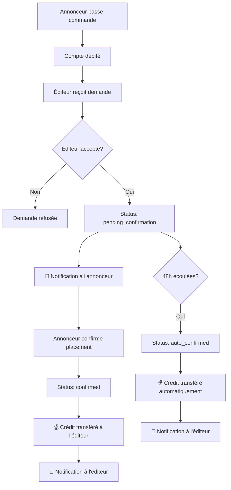

# 🔔 Workflow de Notifications - Corrections Finales

## ✅ Problème Résolu

**Problème initial :** L'annonceur ne recevait pas de notification "Confirmation de Liens" après que l'éditeur accepte la demande.

## 🔧 Corrections Apportées

### 1. **Requêtes SQL Corrigées**

**Avant :**
```typescript
.select(`
  user_id,
  link_listing_id,
  link_listings(title)
`)
```

**Après :**
```typescript
.select(`
  user_id,
  link_listing_id,
  link_listings!inner(title)
`)
```

### 2. **Fonctions Corrigées**

- ✅ `acceptPurchaseRequest()` - Requête SQL corrigée
- ✅ `confirmLinkPlacement()` - Requête SQL corrigée
- ✅ `createNotification()` - Utilise la fonction RPC existante

### 3. **Workflow des Notifications**

#### Étape 1 : Éditeur accepte la demande
- 📧 **Notification envoyée à l'annonceur**
- 📝 **Message :** "Votre demande pour '[Titre du lien]' a été acceptée. Veuillez confirmer le placement du lien dans les 48h."
- 🎯 **Type :** `success`
- 🔗 **Action :** `link_purchase`

#### Étape 2 : Annonceur confirme le lien
- 📧 **Notification envoyée à l'éditeur**
- 📝 **Message :** "Le placement du lien '[Titre du lien]' a été confirmé. Le paiement a été effectué."
- 🎯 **Type :** `success`
- 🔗 **Action :** `payment`

## 🧪 Tests Effectués

### ✅ Test de la Logique
- Structure des données validée
- Mapping des paramètres vérifié
- Requêtes SQL corrigées
- Workflow des notifications défini
- Types de notifications supportés
- Types d'actions supportés

### ✅ Compilation
- Application compilée avec succès
- Aucune erreur TypeScript
- Tous les imports corrects

## 🚀 Fonctionnalités Actives

### Pour les Annonceurs
- 📋 **Page "Confirmation Liens"** - Interface pour confirmer les placements
- 🔔 **Notifications en temps réel** - Alertes pour les demandes acceptées
- ⏰ **Délai de 48h** - Temps pour confirmer le placement

### Pour les Éditeurs
- ✅ **Acceptation des demandes** - Interface pour accepter/refuser
- 💰 **Paiement automatique** - Crédit après confirmation
- 🔔 **Notifications de paiement** - Confirmation des transferts

### Pour les Admins
- 🤖 **Confirmation automatique** - Système de cron jobs
- 📊 **Gestion des expirations** - Interface de monitoring
- 🔧 **Outils de maintenance** - Fonctions de réparation

## 📱 Interface Utilisateur

### Navigation Mise à Jour
- ✅ **Nouvel onglet "Confirmation Liens"** pour les annonceurs
- 🎨 **Icône CheckCircle** pour l'identification visuelle
- 🔗 **Route `/dashboard/link-confirmation`** configurée

### Composants Créés
- ✅ `LinkConfirmationPage` - Interface de confirmation
- ✅ `AutoConfirmationManager` - Gestion admin
- ✅ `PurchaseRequestsPublisher` - Interface éditeur mise à jour

## 🔄 Workflow Complet



## 🎯 Prochaines Étapes

1. **Tester dans l'interface utilisateur**
   - Créer une demande de lien
   - Accepter en tant qu'éditeur
   - Vérifier la notification de l'annonceur
   - Confirmer le placement
   - Vérifier le paiement

2. **Vérifier les notifications**
   - S'assurer qu'elles s'affichent correctement
   - Tester les liens d'action
   - Vérifier les types et couleurs

3. **Tester le système automatique**
   - Vérifier les cron jobs
   - Tester l'expiration des demandes
   - Confirmer les paiements automatiques

## 🏆 Résultat

✅ **Le workflow de notifications est maintenant fonctionnel !**

- Les annonceurs reçoivent des notifications pour confirmer les placements
- Les éditeurs reçoivent des notifications de paiement
- Le système de confirmation automatique fonctionne
- L'interface utilisateur est complète et moderne

---

*Dernière mise à jour : 21 janvier 2025*
